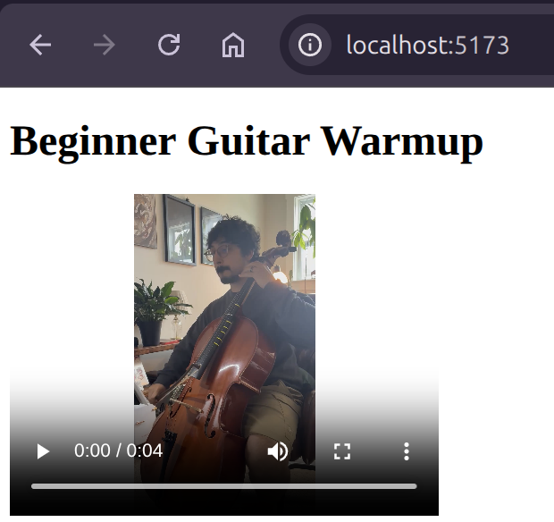
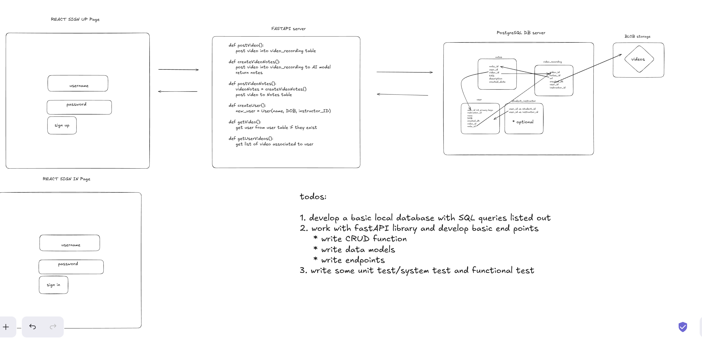
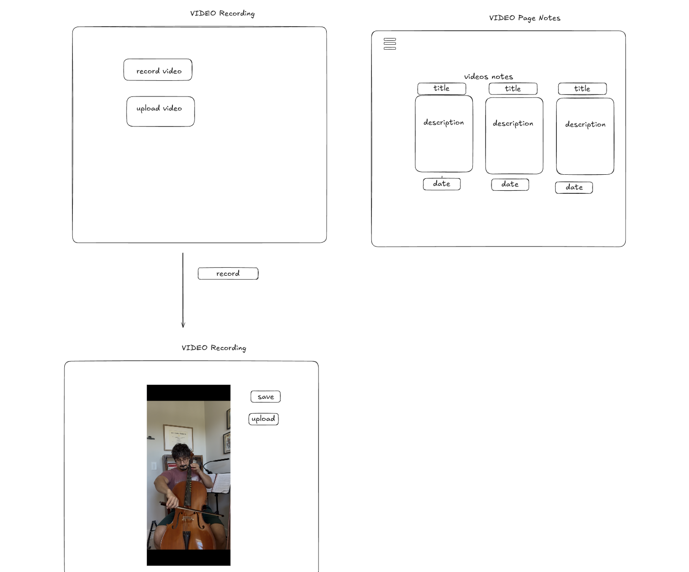

# Music Note Taker

Music Note Taker is a local-first tool for turning music lesson video recordings
into structured notes with an AI model.

## Overview

The goal is to let a user upload or select a lesson video, send that video to an
AI-powered note generation workflow, and store the generated notes alongside the
video metadata in the database.

## Current State



The current app renders video records from the local FastAPI backend. The
frontend fetches the test user's videos, displays each lesson title, and loads
the video source from the backend static video route.

## Tech Stack

- React frontend
- FastAPI backend
- PostgreSQL database
- SQLModel for backend database models and queries
- Vite for local frontend development

## Project Structure

```text
backend-fastapi/
  main.py                 FastAPI app and API routes
  config.py               Database configuration
  datamodel/SQLModels.py  SQLModel table models and queries
  SQL/auth/               Database DDL and seed data
  video/                  Video files served by FastAPI

front-end-react/music-app/
  src/App.tsx             Fetches and renders video records
  src/Video.tsx           Displays individual video players

image/README/             README images and architecture diagrams
```

## Architecture



The app is organized around a simple local development flow:

- The React frontend requests video data from FastAPI.
- FastAPI queries PostgreSQL for users, videos, and future note records.
- FastAPI serves video files from the backend `video/` directory.
- The planned AI workflow will process a selected video and write generated
  notes back to PostgreSQL.

## Basic User Interaction



The current user flow is focused on proving the end-to-end path:

1. The user opens the React app.
2. The frontend requests videos for the test user.
3. The backend reads video metadata from PostgreSQL.
4. The frontend renders each video title and playable video file.
5. A future version will let the user upload a video and generate AI notes.
6. The generated notes will be displayed in the app and stored in PostgreSQL.

## Current Development Endpoints

The app is currently being tested locally with a small set of endpoints:

- `GET /users/1/videos` - returns videos for the test user with ID `1`
- `GET /videos` - returns all videos
- `GET /video/{file_name}` - serves a video file from the backend video
  directory

These endpoints are being used to test the end-to-end flow between the React
frontend, FastAPI backend, and PostgreSQL database.

## Local Development

### Backend

Install the Python dependencies from the backend folder:

```bash
cd backend-fastapi
pip install -r requirements.txt
```

Create a `.env` file using the values needed for the local PostgreSQL database:

```env
DB_NAME=music_app_db
DB_PORT=5432
DB_USER=your_database_user
DB_HOST=localhost
DB_PASSWORD=your_database_password
```

Start the FastAPI server:

```bash
uvicorn main:app --reload
```

The backend runs at:

```text
http://127.0.0.1:8000
```

### Frontend

Install the frontend dependencies:

```bash
cd front-end-react/music-app
npm install
```

Start the Vite development server:

```bash
npm run dev
```

The frontend runs at:

```text
http://127.0.0.1:5173
```

The React app expects the backend to be available at
`http://127.0.0.1:8000` by default. This can be changed with a Vite environment
variable:

```env
VITE_API_BASE_URL=http://127.0.0.1:8000
```

## Planned Workflow

1. Post or upload a video recording.
2. Store the video details in PostgreSQL.
3. Process the video with an AI model.
4. Generate lesson notes from the video.
5. Store the generated notes with the related video and user details.
