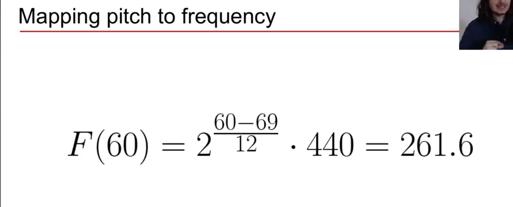
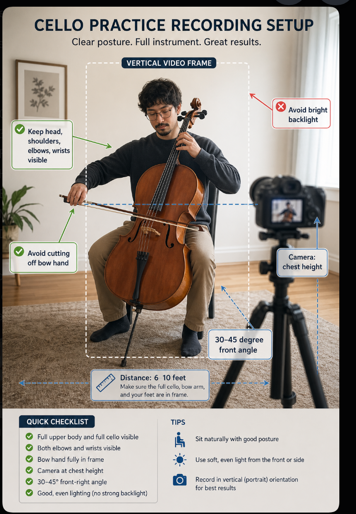

# mapping ptich to frequency

http://youtube.com/watch?v=bnHHVo3j124&list=PL-wATfeyAMNqIee7cH3q1bh4QJFAaeNv0&index=2

# cents

- octave divided in 1200 cents
- 100 cents in a semitone
- notable difference 10-25 cents

